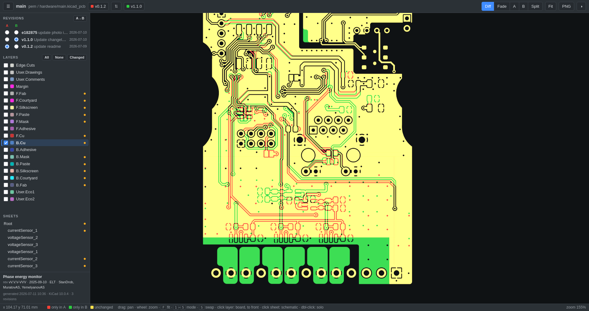

# kdif




Generate an **interactive HTML diff of a KiCad board and schematic** between git
revisions. A single self-contained HTML file in the spirit of
[InteractiveHtmlBom](https://github.com/openscopeproject/InteractiveHtmlBom):
dark/light theme, a layer panel, and a canvas with pan/zoom.

This is **not a KiCad plugin** — the program calls `kicad-cli` (KiCad ≥ 7) and
takes the revisions from the project's git repository.

## Features

- **Comparison modes**: diff overlay (red = only in A, green = only in B,
  yellow = unchanged), a crossfade slider, viewing A/B individually, and
  split-view.
- **Schematic**: the sidebar lists the sheets next to the layers — clicking a
  sheet shows the schematic diff, clicking a layer returns to the board.
  **Multi-sheet (hierarchical) schematics** are supported — each sheet is
  compared separately, changed sheets are marked with a dot, and
  added/removed sheets are shown entirely in green/red.
- **Layers**: toggle each layer on/off, All / None / Changed buttons,
  double-click a layer to solo it. Layers that differ between A and B are
  marked with a dot.
- **Comparison points**: any number of revisions in one file — the A/B pair is
  selected with radio buttons right inside the viewer.
- **Title block**: the bottom of the sidebar shows title / rev / date / company
  / comment from the project — separately for the board and the schematic;
  fields that changed between A and B are shown as `old → new`.
- The HTML itself has no dependencies — attach it to a release or send it to a
  colleague.

## Installation

Download the `.deb` from the [latest release](../../releases/latest) and install it:

```bash
sudo apt install ./kdif_*.deb     # pulls in python3; recommends kicad
```

Or install from source:

```bash
pipx install /path/to/kdif        # or: pip install -e .
```

Or without installing: run `python3 -m kdif ...` from the project directory.

You can also build the `.deb` yourself with `make deb` (needs `dpkg-deb`).

## Usage

The first argument is always the path to a `.kicad_pro` project file — both the
board and the schematic (whichever exist in the repository) are included in the
diff. To compare a single document, point directly at a `.kicad_pcb` or
`.kicad_sch`. The git repository is located from this path.

```bash
# last two commits (default)
kdif hardware/main.kicad_pro

# specific commits/tags/branches (comma-separated lists allowed)
kdif -r v1.0 -r v2.0 hardware/main.kicad_pro
kdif -r 41acedf,main hardware/main.kicad_pro

# last N tags / N commits
kdif --tags 5 hardware/main.kicad_pro
kdif --commits 10 hardware/main.kicad_pro

# also include the current (uncommitted) working tree
kdif --worktree hardware/main.kicad_pro

# select layers and the output file name (all layers are exported by default)
kdif -l F.Cu,B.Cu,Edge.Cuts -o diff.html hardware/main.kicad_pro

# schematic only / board only
kdif hardware/main.kicad_sch
kdif hardware/main.kicad_pcb
```

The result is `<board_name>-diff.html`, which opens in any modern browser.

### Main options


| Option                     | Description                                                                |
| -------------------------- | -------------------------------------------------------------------------- |
| `-r, --ref REF`            | commit/tag/branch; repeatable, comma-separated lists allowed               |
| `--commits N` / `--tags N` | last N commits / tags                                                      |
| `--worktree`               | add the uncommitted state as a`worktree` revision                          |
| `-l, --layers LIST`        | comma-separated layers (default: all board layers)                         |
| `-o, --output FILE`        | output HTML file                                                           |
| `--kicad-cli CMD`          | kicad-cli command, e.g.`'flatpak run --command=kicad-cli org.kicad.KiCad'` |
| `-j, --jobs N`             | parallel kicad-cli processes (default: 4)                                  |
| `--check-zones`            | refill zones before exporting (KiCad ≥ 8)                                 |
| `--no-compress`            | do not compress the SVG inside the HTML (for very old browsers)            |

### Viewer controls

drag — pan · wheel — zoom · **F** — fit the board · **1–5** — modes ·
**S** — swap A and B · double-click a layer — solo · **PNG** button — save the
current view.

## flatpak KiCad

By default `kicad-cli` from `$PATH` is used. If KiCad is installed as a flatpak,
pass the command explicitly:

```bash
kdif --kicad-cli 'flatpak run --command=kicad-cli org.kicad.KiCad' .
```

The flatpak sandbox can only see the home directory, so temporary files are
placed in `~/.cache/kdif` (override with `--workdir`).

## Try it on a fixture

[tests/make_fixture.py](tests/make_fixture.py) builds a deterministic KiCad git
repository (a board and a hierarchical schematic across 3 revisions and 2 tags)
that exercises every diff feature — handy for a quick look or a smoke test:

```bash
python3 tests/make_fixture.py ~/demo-board
kdif --commits 3 ~/demo-board/demo.kicad_pro
```

## How it works

1. Revisions are extracted with `git archive` (the repository is untouched and
   the working tree is never switched). For the schematic, **all** `.kicad_sch`
   files of the revision are extracted with their paths preserved, so
   hierarchical sheets find their files.
2. For every revision and every layer, `kicad-cli pcb export svg --black-and-white --exclude-drawing-sheet --page-size-mode 0` — the full page
   keeps the coordinate anchoring consistent across revisions. The schematic is
   exported with a single `kicad-cli sch export svg` call (all pages at once,
   **with the drawing sheet and title block**); the sheet hierarchy is read from
   the `.kicad_sch` files and pages are matched between revisions by sheet name.
3. A "brightness → alpha" filter is embedded in the SVG, so KiCad's white
   "knocked-out" objects (knockout text, etc.) correctly become transparent.
4. The SVGs are compressed (deflate) and embedded in the HTML; the browser
   decompresses them via `DecompressionStream`, colours them by the alpha
   channel into the layer colour, and blends them additively — matching areas
   turn yellow.
